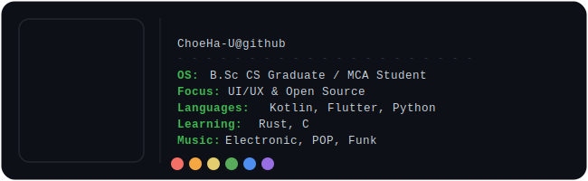

 < 

 

# **ALEN SONY (ChoeHa-U)**
### Novice UI Designer · Trying to Code

BSc Computer Science Graduate, Currently pursuing MCA | 
Passionate about UI/UX & Mobile Development

---

### Tech Stack

  

### Currently Learning

  

---

### Projects

| Project | Description | Tech |
|---------|-------------|------|
| Open D Life | A wellness app | Kotlin · Jetpack Compose |
| Breathe UI Concept | Wellness space with Neumorphism design | Figma |

---

### Goals

- Build polished mobile apps with great UI
- Contribute to open source projects
- Land a UI/UX or mobile dev internship

---

### Contact

